# ゆめみパスポート Flutter 課題

### アプリの概要

[ゆめみパスポート](https://github.com/yumemi-inc/flutter-engineer-codecheck)の Flutter エンジニアの課題です。

### 課題内容

次の要件を満たす Flutter アプリを作成する。

<details>
<summary> 要件はこちら

</summary>

#### 環境

- IDE・SDK・プログラミング言語については、基本的に最新の安定版を利用すること
- 最新の安定版以外を利用する場合は、理由も含めて README に記載すること
- 状態管理パッケージには Provider/Riverpod のいずれかを使うこと
- サードパーティーライブラリについては、オープンソースのものに限り制限しない

#### 対象 OS バージョン

基本的に Flutter プロジェクト作成時のバージョンにすること

| OS      | Version    |
| ------- | ---------- |
| iOS     | 9.0 ~ 15.2 |
| Android | 4.1 ~ 12   |

※ 本プロジェクト更新時点

#### 動作

- 何かしらのキーワードを入力できる
- 入力したキーワードで GitHub のリポジトリを検索できる
- GitHub のリポジトリを検索する際、GitHub API（search/repositories）を利用する
- github | Dart Package のようなパッケージは利用せず、API を呼ぶ処理を自分で実装すること
- 検索結果は一覧で概要（リポジトリ名）を表示する
- 検索結果のアイテムをタップしたら、該当リポジトリの詳細（リポジトリ名、オーナーアイコン、プロジェクト言語、Star 数、Watcher 数、Fork 数、Issue 数）を表示する

#### デザイン

マテリアルデザインに準拠すること

---

</details>

### アプリの特徴と画面のデザイン

#### 特徴

要件以外にも、以下の特徴を持つアプリを作成しました。

- ダークモード対応（デバイスの設定を利用することも可能）
- 日本語以外に、英語にも対応（アプリ内で変更することが可能）
- アニメーションを用いた UX の向上
- 統一されたデザインとテーマ
- リポジトリの使用言語と色の対応
- 検索結果が多数の場合、スクロールで追加のリポジトリを読み込む

#### 画面のデザイン

- アプリの起動 -> 検索画面 -> 設定画面

  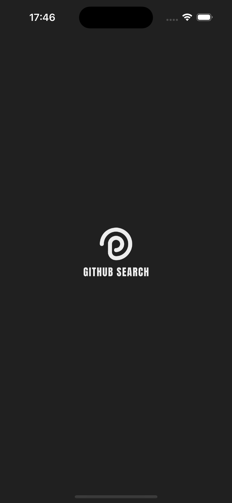 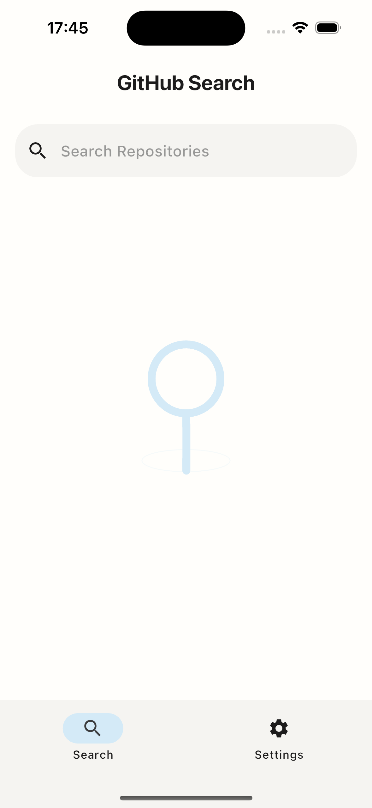 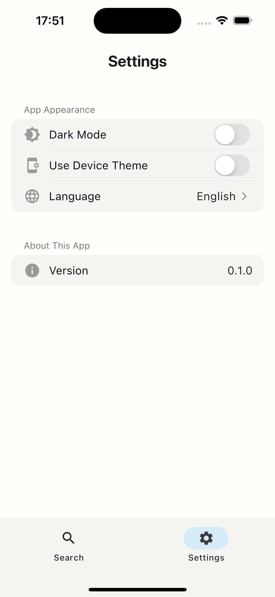

  <br>

- 検索ワードの入力 -> 検索結果画面 -> リポジトリ詳細画面

  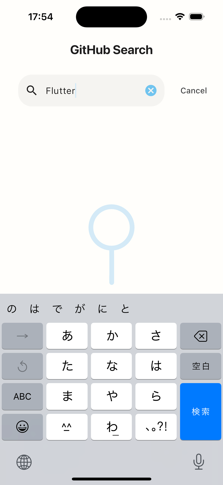 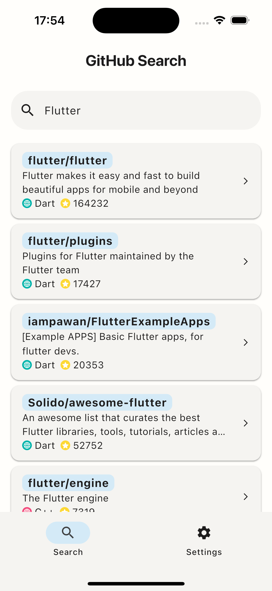 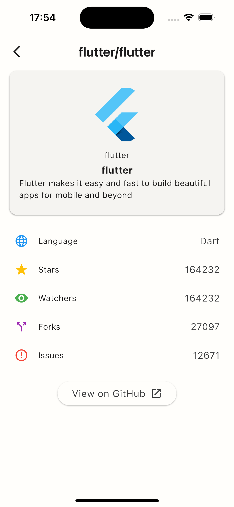

  <br>

- 多言語対応、ダークモード対応

  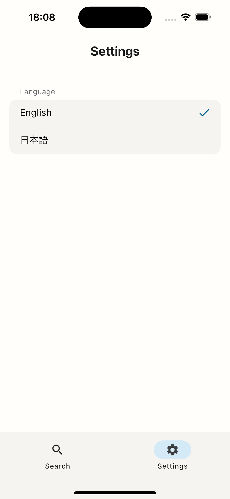 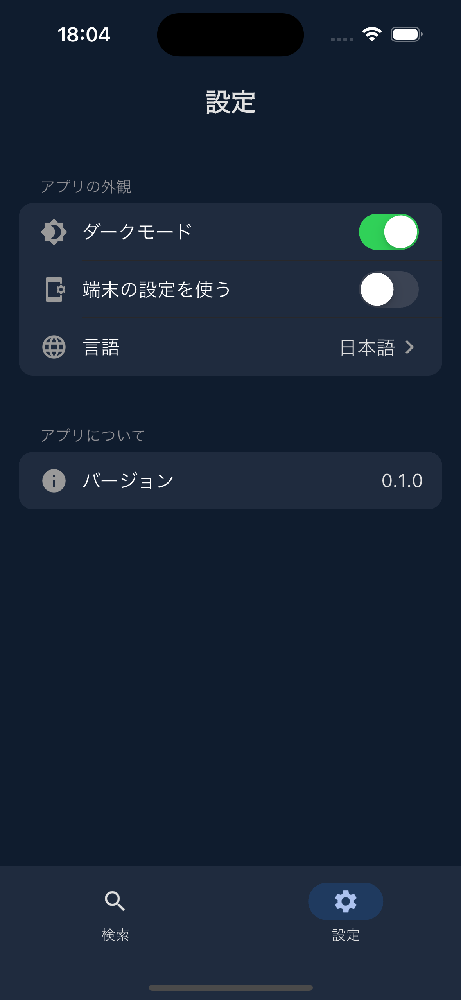 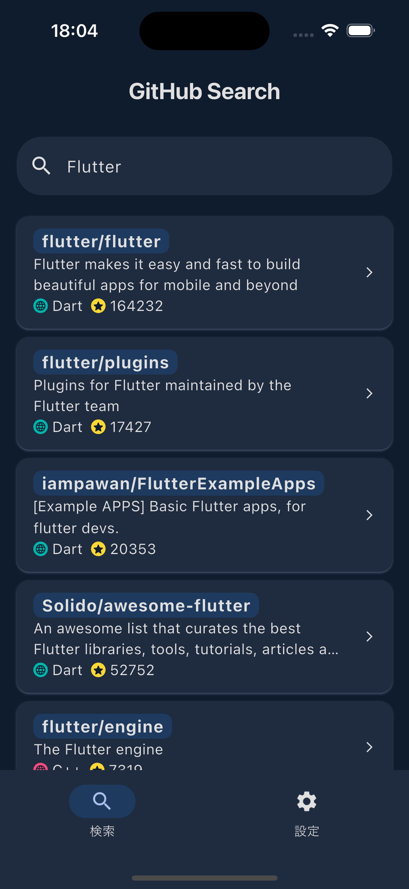

  <br>

- その他（アプリ内サイト閲覧、使用言語と色の対応、スクロールによるリポジトリの読み込み）

  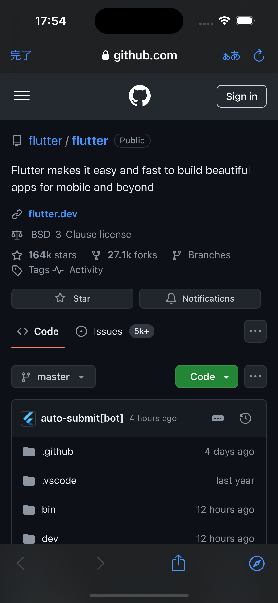 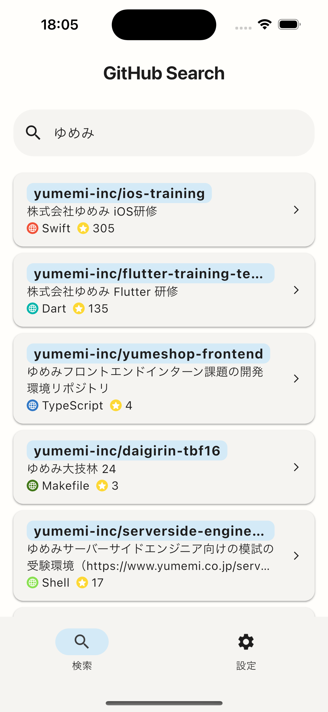 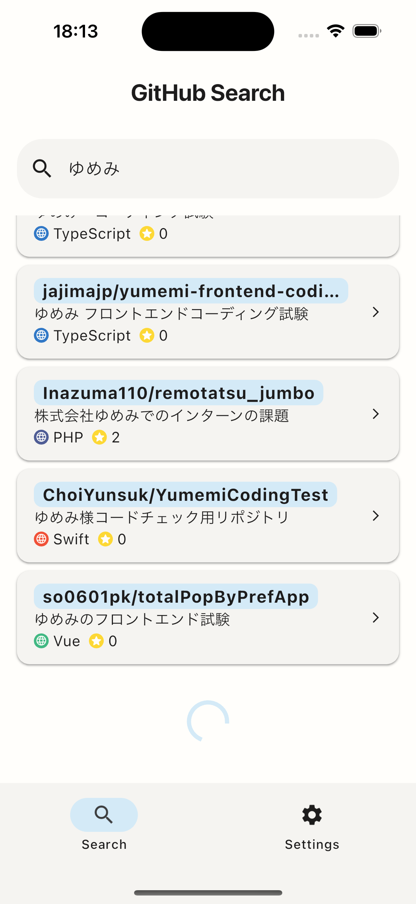

  <br>

### ディレクトリ構成

[Andrea Bizzotto さんが紹介されていたアーキテクチャ](https://codewithandrea.com/articles/flutter-app-architecture-riverpod-introduction/)を参考にしました。

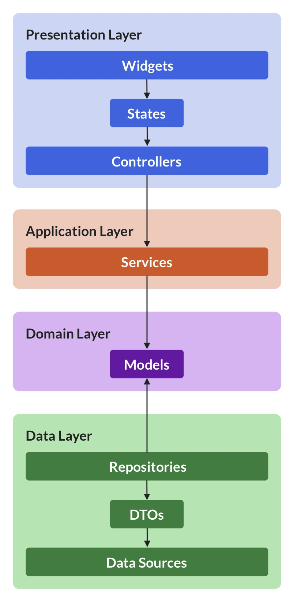

```bash
lib
 ├── l10n                    # 多言語対応
 ├── main.dart               # アプリのエントリーポイント
 └── src
     ├── components              # 再利用可能なコンポーネント
     ├── constants               # 定数
     │
     ├── features                # 機能ごとにディレクトリを分ける
     │   ├── base                    # アプリの土台 （共通のAppBarやナビゲーションバーなど）
     │   ├── search                  # 検索機能
     │   │   ├── data                    # データ層（外部のAPIとのやりとり）
     │   │   ├── domain
     │   │   ├── presentation            # UI及び、stateの管理（コントローラ）
     │   │   └── service                 # コントローラとデータ層の橋渡し
     │   └── settings                # 設定機能
     │       ├── domain
     │       └── presentation
     │
     ├── router              # ルーティング
     └── utils               # ユーティリティ
```

### ビルド手順

1. このプロジェクトをクローンしてください。

   ```bash
   git clone https://github.com/hiropoo/github_search
   ```

2. プロジェクトのルートディレクトリに移動してください。

   ```bash
   # 例
   cd github_search
   ```

3. `.env` ファイルに GitHub のアクセストークンを設定してください。

   ```bash
   # 'your_github_api_key' に、GitHub のアクセストークンを設定してください。
   echo "API_KEY=your_github_api_key" > .env
   ```

4. 次のコマンドで設定を初期化してください。
   ```bash
   make init
   ```
5. 次のコマンドでアプリを実行してください。

   ```bash
   make run
   ```

### 今後の課題と反省

今回の課題は、1 週間という期間での実装が求められたため、まだ実装できていないことも多いです。具体的に、以下の点が実装できておらず今後改善していきたいと思っています。

- テストコードの追加
- CI/CD の導入
- Sliver Widget を用いた UX の向上
- より適切なエラーハンドリングとエラーメッセージの表示
- ソート機能の追加
- レスポンシブデザインの対応

また、一つひとつ勉強しながらの実装だったとはいえ、コードの品質や書くスピードの向上など、課題が多く見つかりました。今後は、それらをより意識して取り組んでいきたいと思っています。

#### 主に使用した Flutter パッケージ

- [flutter_riverpod](https://pub.dev/packages/flutter_riverpod)
- [flutter_hooks](https://pub.dev/packages/flutter_hooks)
- [riverpod_generator](https://pub.dev/packages/riverpod_generator)
- [build_runner](https://pub.dev/packages/build_runner)
- [freezed](https://pub.dev/packages/freezed)
- [shared_preferences](https://pub.dev/packages/shared_preferences)
- [go_router](https://pub.dev/packages/go_router)
- [dio](https://pub.dev/packages/dio)

---

### 最後に

プロジェクトをご覧いただき、ありがとうございます。
